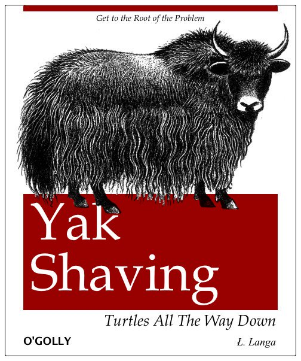

# Yak Shaving 

*Image: https://twitter.com/llanga*

Yak shaving is a progranming term that refers to a series of tasks that need to be performed before a project can progress to its next milestone. This term is believed to have been coined by Carlin Vieri and was inspired by an episode of "The Ren & Stimpy Show." The term's name alludes to the seeming uselessness of the tasks being performed, even though they may be necessary to solve a larger problem. The process of complicating a simple activity also may be considered yak shaving.

From: https://www.techopedia.com/definition/15511/yak-shaving

## More on Yak Shaving

* https://seths.blog/2005/03/dont_shave_that/
* https://americanexpress.io/yak-shaving/
